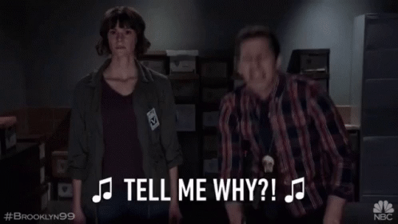

# eslint-plugin-why

Enforces adding a comment before disabling an ESLint rule.



Trying to understand why someone ignored that lint rule? Need an explanation for what the heck is going on?
Add eslint-plugin-why to your codebase and make contributors tell you why:

```
error  Expected an eslint-why comment before eslint-disable  why/tell-me-why
```

# Installation

Install the plugin

```sh
$ npm install eslint-plugin-why --save-dev
```

# Configuration

Add the following preset to your ESLint configuration:

```json
  "extends": [
    "plugin:why/error"
  ]
```

But if you find it too aggressive, there's a preset that uses warnings instead of errors:

```json
  "extends": [
    "plugin:why/warning"
  ]
```

Or you can add the rule yourself:

```json
  "rules": {
    "why/tell-me-why": "error"
  }
```

## Rule: why/tell-me-why

### Good Examples

```js
// eslint-why some people just want to watch the world burn
// eslint-disable-next-line semi
someCodeHere();
```

```js
/*
    eslint-why
    because I like unexpected surprises
*/
// eslint-disable-next-line semi
someCodeHere();
```

### Bad Examples

No why comment:

```js
someCodeHere();

// eslint-disable-next-line semi
someCodeThere();
```

Why comment is too far away:

```js
// eslint-why because testing in production is the only way we do

console.log("I like turtles");

// eslint-disable-next-line semi
someCodeHere();
```

## Contributors

- [Cole Turner](https://github.com/coleturner)
